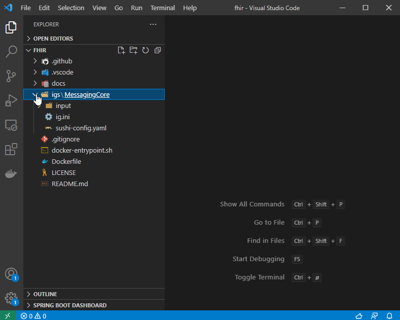

# Overview
Dette repoet er tiltenkt å fungerer som et monorepo for kildekoden til alle NAV sine FHIR Implementation Guides (IG).
De forskjellige IGene genereres og publiseres automatisk som github-pages:
1. [MessagingCore](https://navikt.github.io/fhir/igs/MessagingCore/)

## 🐟 FHIR Shorthand og SUSHI
Repoet inneholder [FHIR Shorthand](https://fshschool.org/) (FSH) prosjekter. FSH er et deklarativt og utviklervennelig språk for å definere FHIR ressursene som inngår i profiler. FHIR ressurser genereres vha. [SUSHI](https://github.com/FHIR/sushi); en kompilator som transformerer FSH til FHIR ressurser, dette repoet inneholde derfor ikke FHIR ressurser av type ImplementationGuide, StructureDefinition, CodeSystem, ValueSet etc.

SUSHI vil også benytte **sushi-config.yaml** [for å generere](http://build.fhir.org/ig/HL7/fhir-shorthand/branches/beta/sushi.html#configuration-file) **package-list.json og menu.xml** som kreves av IG Publisher, disse filene er derfor heller ikke med.

NAV har valgt å bruke FSH istedenfor [Forge](https://fire.ly/products/forge/); et GUI verktøy som generer FHIR ressurser, siden det gir bedre kildekodekontroll og lettere lar seg integerere i CI\CD-pipelines. Forge krever også lisens og fungerer bare på Windows.

## 📙 Bruk av begreper
I FHIR verden brukes ofte begrepene implementasjonsguide, pakke, profiler og kontrakter\datamodeller om hverandre. Dette kan være forvirrende og vi skal prøve å oppklare:

* En [FHIR profil](https://www.hl7.org/fhir/profiling.html) er en kontrakt (datamodell+regler) for bruk av en FHIR ressurs (f.eks Patient). En profil er implementert som egne FHIR ressurser (json/xml) laget for dette formålet, f.eks StructureDefinition.
* En FHIR Implementation Guide er en samling av:
    * FHIR ressurser som utgjør profiler.
    * En HTML side for human-readable dokumentasjon.
    * Generell metadata implementert som en egen FHIR ressurs som også heter [ImplementationGuide](https://www.hl7.org/fhir/implementationguide.html).
    * Eksempler på FHIR ressurser som er ihht. profilene.
* En [FHIR NPM Package](https://registry.fhir.org/learn) er IGen pakket som en NPM pakke. Avengigheter til andre IGer er gjenngitt som versionerte dependencies i package.json. En slik pakke kan brukes til validering og testing av FHIR ressurser.

Mao. er det en 1:1:1 mapping mellom FSH-project, IG og FHIR Package.

## 📦 IG Publisher
[IG Publisher](https://confluence.hl7.org/display/FHIR/IG+Publisher+Documentation) er en open source java applikasjon ([github](https://github.com/HL7/fhir-ig-publisher)) som tar fhir-ressurser, markdown og bilder som input og bruker Jekyll til å generere en statisk HTML side som kan brukes som dokumentasjon. Dette pakker den også i en FHIR NPM Package for distribuering.

Et FSH prosjekt følger en [bestemt struktur](https://fshschool.org/docs/sushi/project/), denne strukturen har likheter med [strukturen som forventes av IG Publisher](https://build.fhir.org/ig/FHIR/ig-guidance/using-templates.html). Tidligere var det slik at SUSHI måtte kjøres på et FSH prosjekt for å generere inputten til IG Publisher, men [fra og med v1.0.75 er dette unødvendig](http://build.fhir.org/ig/HL7/fhir-shorthand/branches/beta/sushi.html#ig-publisher-integration-autobuild-configuration).

## 🚀 CI/CD
Generering og deployment av IGene gjøres vha. github-actions som kjører IG Publisher og commiter artefaktene (html, css, js, assets) til en egen **gh-pages branch** som hostes med github-pages. Dette kan alternativt bli gjort av HL7 sin [Auto-IG-builder](https://github.com/FHIR/auto-ig-builder), men da mister vi litt fleksibilitet, vi må f.eks bruke domenet `https://build.fhir.org/ig`.

### Releases
Publisering av releases til [FHIR Package Registry](https://registry.fhir.org/) krever en del manuelle steg som er [dokumentert her](https://confluence.hl7.org/pages/viewpage.action?pageId=97454344#FHIRPackageRegistryUserDocumentation-Themanualprocess). Vi har prøvd å automatisere dette så mye som mulig vha. GitHub-actions. 

Gitt at følgende kriterier for en IG gjelder:
- Version i sushi-config.yaml er oppdatert. 
- ReleaseLabel i sushi-config.yaml er satt til **release**.
- Versionen er dokumentert i `{ig}/input/pagecontent/CHANGELOG.md`.

Når nevnte kriterier er oppfyllt vil en ny repository release lages og [package-feed.xml](https://navikt.github.io/fhir/package-feed.xml) automatisk oppdateres. Hvis feeden er registrert i HL7 sin [package-feeds.json](https://github.com/FHIR/ig-registry) vil pakken automatisk publiseres i FHIR Package Registry. Husk at publiserte pakke versioner er immutable og kan ikke slettes.

# Development
For å bygge IGer lokalt trenger du SUSHI, IG-Publisher og alle avhengighetene. Dette kan du installere ved å følge de respektive installasjonsveiledningene, alternativt kan du bruke et docker-image, isåfall må du installere [Docker](https://docs.docker.com/get-docker/).

## 👨‍💻 Visual Studio Code
For utvikling av IGer er det greit å bruke [vscode](https://code.visualstudio.com/).

[vscode-language-fsh](https://marketplace.visualstudio.com/items?itemName=kmahalingam.vscode-language-fsh) extension hjelper med litt syntax highlighting og IntelliSense og skal komme som en [anbefaling](.vscode/extensions.json) når du åpner repoet i vscode.

Vi har lagt til FHIR json skjema referanse i [.vscode/settings.json](.vscode/settings.json) slik at du får IntelliSense dersom du jobber med FHIR json ressurser direkte.

Det er laget egne tasks i [.vscode/tasks.json](.vscode/tasks.json) som kan brukes for å bygge og teste IGen, disse vil automatisk bygge docker-build-imaget dersom det ikke allerede finnes, dette tar noen minutter. For å kjøre en task må du ha åpen **ig.ini** filen til fsh-prosjektet du jobber med. SUSHI er registrert som en bygg-task og kan dermed kjøres vha. **ctrl+shift+b** hurtigtast, de andre taskene kan du velge ved å trykke **F1** og deretter skrive **Tasks: Run task**.



## 🐋 Docker build image
Fordi transformeringen av et FSH Project til en IG krever mange dependencies (java, nodejs, npm, ruby, jekyll, sushi, ig-publisher etc.) har vi laget en Dockerfile for å bygge et docker-image som inneholder både SUSHI, IG-Publisher og [FHIR Validator](https://confluence.hl7.org/display/FHIR/Using+the+FHIR+Validator) + alle nødvendige dependencies. 
Hvis du bruker vscode og de definerte tasksene trenger du ikke forholde deg til følgende, men her er hvordan du bruker imaget:

Kjør følgende kommando fra .docker katalogen til dette repoet for å bygge docker-imaget, dette tar ca 4 minutter.
```
docker build -t navikt/fhir-ig-dev .
```

[SUSHI](https://fshschool.org/docs/sushi/running/#running-sushi) kjøres med følgende kommando, dette tar normalt noen sekunder og vil generere en **fsh-generated** katalog med fhir-ressurser innenfor fsh-prosjektet.
```
docker run --rm -v {fsh-project-dir}:/data navikt/fhir-ig-dev sushi /data

## Eksempel på windows:
docker run --rm -v c:\repos\fhir\igs\MessagingCore:/data navikt/fhir-ig-dev sushi /data
```

[FHIR Validator](https://confluence.hl7.org/display/FHIR/Using+the+FHIR+Validator#UsingtheFHIRValidator-Runningthevalidator) brukes for å validere fhir-ressurser og f.eks ressursene generert av sushi kan valideres med følgende kommando.
```
docker run --rm -v {fsh-project-dir}:/data navikt/fhir-ig-dev validator /data/fsh-generated/resources
```

[IG-Publisher](https://wiki.hl7.org/IG_Publisher_Documentation#Running_in_command_line_mode) kjøres med følgende kommando, dette tar gjerne 3-4 minutter og vil generere en rekke kataloger innenfor prosjektet.
```
docker run --rm -v {fsh-project-dir}:/data navikt/fhir-ig-dev publisher -ig /data/ig.ini
```

### Package-cache
Eksemplene over bruker alle [`--rm`](https://docs.docker.com/engine/reference/run/#clean-up---rm) flagget som gjør at containeren slettes etter kjøringen, dette vil si at alle pakker må lastes ned for hver gang og det kan derfor være greit å lage et eget volume for **package-cache**, i tillegg kan det være greit å bruke `-it` flagget slik at du kan bruke *ctrl+c* for å avbryte kjøringer. Eksempel med sushi blir da følgende (gjelder også validator og publisher).
```
docker run -it --rm -v package-cache:/root/.fhir -v c:\repos\fhir\igs\MessagingCore:/data navikt/fhir-ig-dev sushi /data
```
